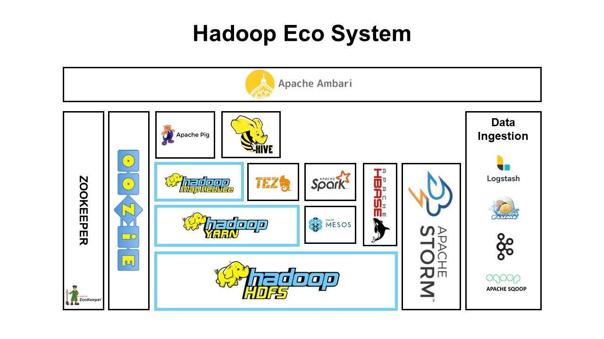

# 하둡 생태계 개요

## 하둡 생태계

## 각 기술에 대한 간략한 요약

### Hadoop HDFS

- Hadoop File System
- 하둡의 분산 파일시스템
- 빅데이터 저장을 클러스터 전체에 분배해 마치 하나의 하드 드라이버의 파일시스템으로 보이게 하는 역할
- 서버가 다운 되더라도 복구 능력이 있음

### Hadoop YARN

- Yet Another Resource Negotiator
- HDFS가 분산저장이라면 YARN은 데이터 처리부분
- 어떤 노드가 작업을 할지 결정하고 노드를 관리하는 하둡의 심장과도 같은 역할

### Hadoop MapReduce

- 전체 클러스터에 데이터를 처리할 수 있게 하는 모델
- Mapper + Reducer
- Mapper : 전체 클러스터에 병렬적으로 데이터를 전환
- Reducer : 데이터를 종합하는 역할
- 복잡한 문제를 해결해주는 역할

### Pig

- SQL처럼 간단한 쿼리로 하둡의 데이터를 mapreduce 위에서 데이터를 받을 수 있음

### Hive

- Pig와 같은 문제를 해결해줌
- 하지만 더 SQL과 비슷한 형태로 쿼리를 처리함

### Ambari

- 가장 위단에서 클러스터의 상태를 시각화 해주는 툴
- Pig 쿼리 실행하거나 각 클러스터의 CPU 점유율 등을 모두 시각화 해줌

### MESOS

- Hadoop의 일부분은 아니지만 YARN을 대체할 수 있는 소프트웨어
- YARN과 같이 쓰이기도 함

### Spark

- MapReduce처럼 쿼리작업을 함
- 파이썬 혹은 스칼라를 사용해서 스크립트 입력함
- 현재 매우 활동적인 개발로 가장 빠르고 강력한 기술
- 하둡 클러스터에서 효율적이고 빠르게 데이터를 처리할 수 있고 스트리밍 데이터까지 처리가 가능함 이로인해 ML쪽 데이터 학습에도 쓰이는 것 같음

### TEZ

- 스파크와 같은 방향성 비순환 그래프를 사용
- 쿼리를 실행하는데 최적의 계획을 세울 수 있어 가속화 작업에 사용

### Hbase

- 클러스터 데이터를 업무 플랫폼에 노출시키는 방법
- NoSQL 데이터베이스라고도 불림
- 칼럼 형태의 데이터 스토어

### Storm

- 스트리밍 데이터를 실시간으로 빠르게 처리하는 기술
- 로그, 센서 등을 처리할 수 있는 기술
- 배치가 없기 때문에 실시간 ML 학습과 같은 업무를 시킬 수 있음

### OOZIE

- 클러스터 스케줄링 하는 기술

### Zookeeper

- 클러스터의 모든 것을 Coordinating 하는 기술
- 클러스터 상태를 추적하는데 매우 용이한 기술 --> Reliability 제공

### Data Ingestion (Logstash, Flume, Sqoop, Kafka etc)

- 다른 DB와 DB를 연동
- WAS로그를 HDFS로 보낸다거나
- 실시간 데이터를 수집하고 하둡 클러스터로 보낸다거나 등의
- Data Ingestion 문제를 해결해주는 기술들
