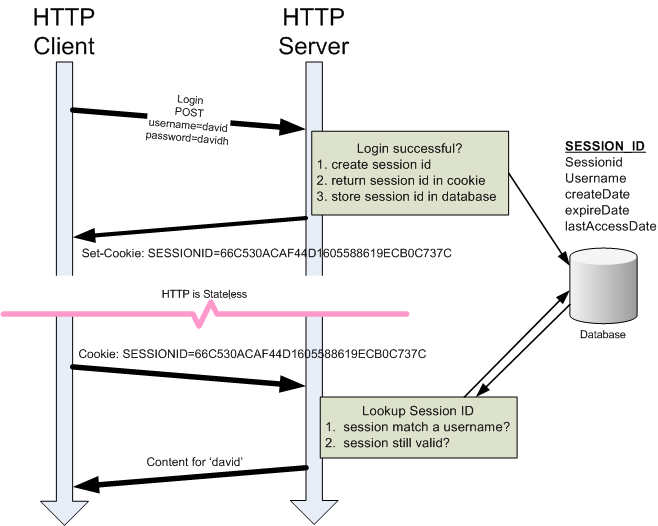

# Chapter2 응용계층
# Cookie
## 웹 응용의 구조
웹 클라이언트는 응용계층 -> 세션 계층 순으로 보면 **현재 홈페이지**, **HTML 엔진**, **HTTP protocol** 을 가지고 있고
    
웹 서버는 위와 같은 순으로 **서버 응용**, **서버 응용 엔진**, **HTTP protocol**을 가지고 있다.

이 때 서버의 세션계층인 HTTP protocol은 stateless하다 즉, 요청-응답을 마치면 더 이상 정보를 가지고 있지 않는다. 그렇다면 사용자 정보 (로그인 같은 경우) 어떻게 정보를 가지고 있을까? => **쿠키를 사용하면 된다.**

## 쿠키란
서버 응용이 **클라이언트의 이전 작업 정보를 파악**하기 위한 도구

## 프로토콜
- HTTP Response Header : Set-Cookie 필드
- HTTP Request Header : Cookie 필드

## 방법론
- 기억해야 할 정보들을 **쿠키에 담아 클라이언트가 기억**하도록 하고 **서버는 클라이언트가 방분시 주는 쿠키 정보에 맞추어 반응**해준다.
 
    문제점 ==> 클라이언트에 너무 많은 권한과 정보를 준다.
    
    해결책 ==> 세션

## 세션
- 클라이언트에 세션 ID 정보(일종의 이름표)만 쿠키로 전달하고 세션들의 특징은 서버가 관리하도록 한다.

## HTTP Transaction의 성능 향상
HTTP Transaction에는 크게 세 가지 방법이 있다.
1. Short-lived connection
2. Persistent connection
3. HTTP pipelining

위 방법들의 성능을 알아보도록 하자.

## 성능 지표
성능을 측정하기 위해서 측정 기준이 있어야한다. 수업에서 두 가지 측정 기준을 설명해준다.

1. 지연시간 : **패킷을 보내기 시작한 시점**에서 **패킷을 받기 시작한 시점**까지 걸리는 전송 지연시간.

2. 전송률 : 단위시간당 전송되는 데이터의 양.

=> 두 지표는 목적에 따라 중요도가 다를 수 있다.

ex) 양 끝단 간 지연시간이 100ms 이고 전송률이 100MB/s인 네트워크에서 1MB를 전송해 수신을 완료하는데 걸리는 시간?

## Connection management별 성능 비교
1. 끝단 간 지연시간 : 100ms
2. 전송률 : 100KB/s
3. 전송 받고자 하는 정보
    
    - HTML : 1KB
    - Image 3개 : 각 10KB
4. 헤더 크기

    - Req, Res 각 1KB

5. TCP 연결/종결에 걸리는 시간 : 각 400ms/200ms

정보 수신완료 시간(HTML) : 230ms + 400ms(TCP 연결)
이미지 수신완료 시간 : 320ms + 400ms(TCP 연결)

### Short-lived connection
920 * 3 + 830 = 3590ms

### Persistent connection
3590 - 600 * 3 = 1790ms

### HTTP Pipelining
630 + 30 + 300 = 960ms

=> 이 중에서는 HTTP Pipelinig이 가장 효과적인 connection management이다.