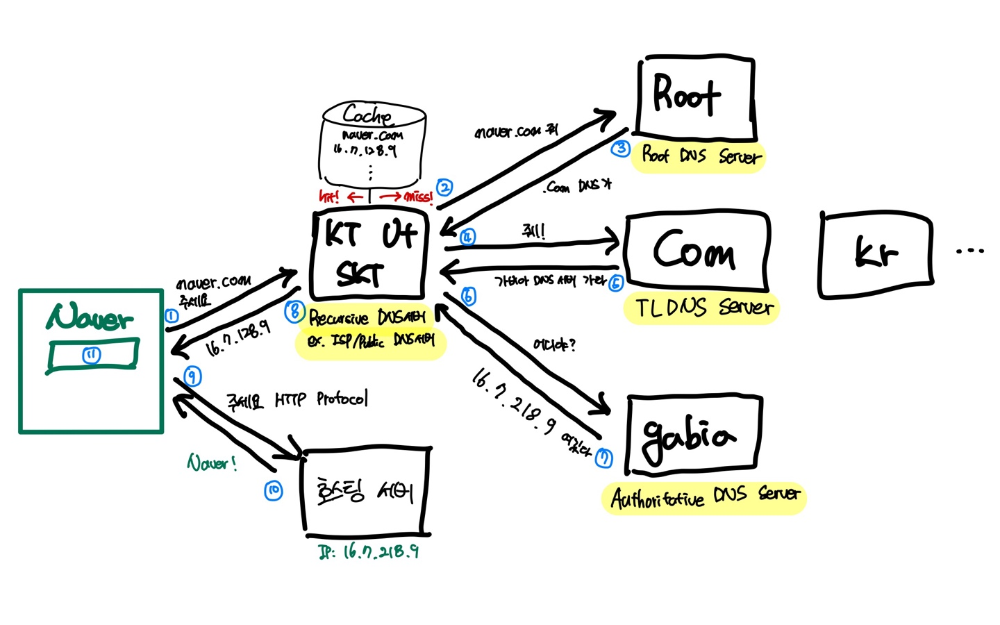

# Chapter2 응용계층
# DNS
## Domain Name System
### Internet에서의 Identification
- IPv4 : 32bit - xxx.xxx.xxx.xxx => 8진수 4개 (약 40억개 나중에 부족 현상)
- IPv6 : 128bit - xxxx:xxxx:... => 16진수 8개 (부족할걸 대비해 확 늘림 but 16진수라 기억하기 어렵고 또한 너무 길어서 잘 사용 안함)
- Domain Name
    - 순수하게 인간을 위한 시스템(문자로 구성)
    - 응용 계층(인터넷 5계층)에서만 관여 그 밑은 전혀 관여X

### Domain Name System 서비스
- Domain Name -> IP 주소 매핑해주는 시스템
- Aliasing 관리
    -  여러 도메인으로 같은 웹페이지를 열 수 있음(ex. google.com, goo.gl 이 같은 페이지로)
- 전우주적으로 중앙관리
- **계층적 분산 관리**가 가능

### DNS의 계층
- 최상위 DNS Server
    - ICANN이 관리하는 꼭대기 서버, **Top-Level Domain DNS 서버 IP를 저장하고 안내**하는 역할을 함
    - **Top-level domain name(ex. .kr, .com, .edu etc) server 관리**
    - Top-level domain server의 **IP 반환**(유효기간과 함께)
    - 유효기간 동은 동일한 Top-level domain server에 요청할 필요 없음
- Top-Level Domain DNS Server(TLD DNS Server)
    - 도메인 등록 기관(Registry)이 관리하는 서버
    - **Authoritative DNS 서버 주소를 저장하고 안내**하는 역할
    - 도메인 판매 업체(Registrar)의 DNS 설정이 변경되면 Registry로 전달이 됨
- Authoritative DNS Server
    - **실제 개인 도메인과 IP 주소 관계가 저장/변경 되는 서버**.
    - **개인 DNS서버** 혹은 **도메인/호스팅 업체**가 여기에 해당(ex. 가비아)
- Local Server(Recursive DNS Server)
    - **인터넷 사용자가 가장 먼저 접근하는 서버**
    - **캐시를 가지고 있음** => 매번 Recursive 돌면 매우 비효율적 이므로
    - 대표적으로 KT/LG/SK 통신사(Internet Service Provider)가 있고 **클라우드플레어** 같은 Public DNS도 있음

### DNS 동작 원리



> 1. 인터넷 브라우저에 사용자가 naver.com 검색
> 2. ISP서버에서 캐시 miss로 Root DNS Server에 요청
> 3. Root DNS Server는 Top-Level DNS Server의 주소들을 관리하고 있기 때문에 .com TLD DNS Server의 주소를 알려줌
> 4. .com TLD DNS Server에 다시 요청함
> 5. .com 서버에서 해당 도메인이 가비아 서버에서 관리되어 있음을 확인하고 반환함
> 6. ISP가 다시 가비아 서버에 요청
> 7. 가비아 서버는 naver.com이 16.7.218.9가 매핑되어 있음을 확인하고 해당 IP주소를 반환해줌
> 8. ISP는 브라우저에 IP주소를 반환해줌
> 9. 드디어 호스팅 서버에 웹사이트 html을 요청
> 10. 끝!!

### 실습 (Linux)
- nslookup 명령어 : DNS서버에 요청해 도메인의 정보를 조회하는 명령어
    ```shell
    $ nslookup google.com
    Server: xxx.xxx.xxx.xxx
    Address: xx...

    Non-authoritative answer:
    Name : google.com
    Address : xxx.xxx.xxx.xxx (해당 IP치면 google.com으로 이동함)
    Name : google.com
    Address : xxx.xxx.xxx.xxx (로드밸런싱)
    .
    .
    .
    ```
- dig 명령어 : DNS Name Server의 정보를 확인할 수 있음
    ```shell
    $ dig com. ns
    com. Name Server들을 확인할 수 있음
    .
    .
    .
    ```


### P2P (Peer-to-Peer)
- 서버없이 단말기 끼리 직접 상호간 서비스를 제공하는 시스템
- Peer들은 IP를 바꾸며 옮겨 다닐 수 있기 때문에 서비스를 보장 못함

### Hybrid System
- 서비스 메타정보는 서버가 관리하고 실제 서비스는 Peer-to-Peer
- 대표적으로 Skype, Starcraft (상대 매칭 이후는 Peer-to-Peer)

### Pure P2P
- 대표적으로 토렌트
- 문제가 많음
    - 신뢰성문제
    - 이기적인 현상 발생(파일 받기만 하고 주려고 안함) -> 파일 주는 단말기에 우선순위 부여로 해소 가능
    - 파일 조각 쏠림 현상 -> 많이 가지고 있지 않은 파일 조각부터 가져옴

# Ref.
https://gentlysallim.com/dns%EB%9E%80-%EB%AD%90%EA%B3%A0-%EB%84%A4%EC%9E%84%EC%84%9C%EB%B2%84%EB%9E%80-%EB%AD%94%EC%A7%80-%EA%B0%9C%EB%85%90%EC%A0%95%EB%A6%AC/