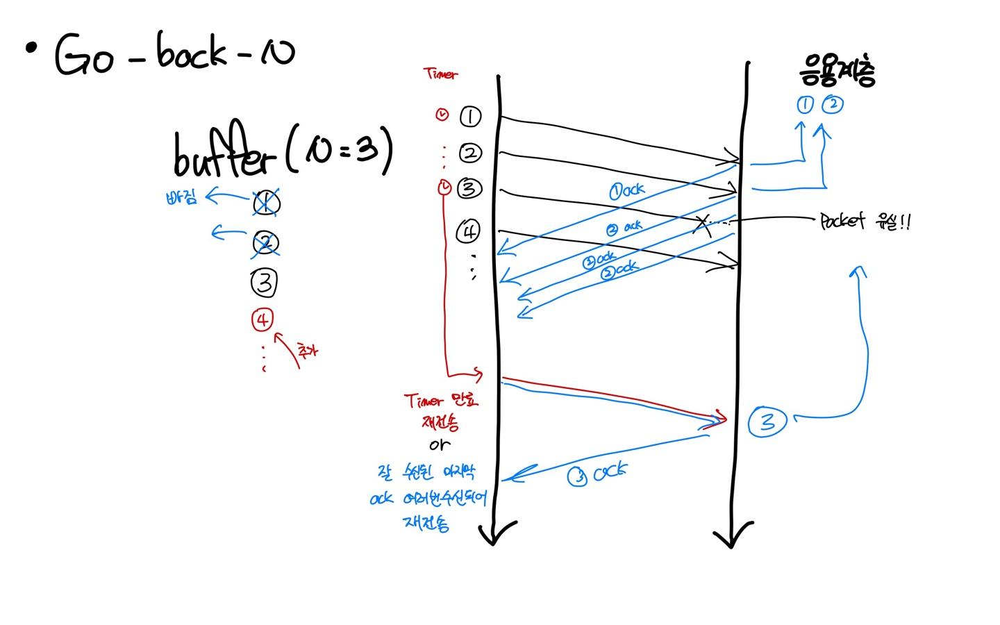
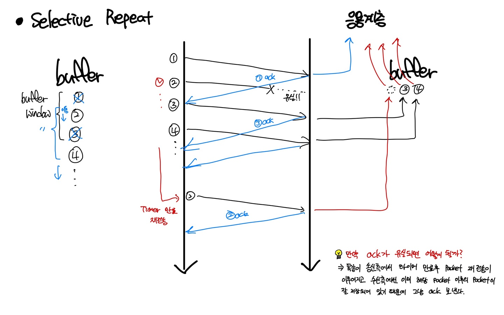

# Chapter3 전송계층
# 전송계층
Reliable Network를 어떻게 구성하는 것인지가 중요한 계층이다.

## Pipelining 방법
## Go-back-N
### 개념
- 최대 N개의 packet을 병렬적으로 처리하는 방법
- **송신측**에서는 N개의 packet을 재전송을 하기 위해서 buffering 해놓는다.
- **수신측**에서는 순차적으로 잘 수신된 packet에 대해 ack(acknowledge)를 송신측에 보내고 packet의 payload를 응용계층으로 보낸다.
- 송신측은 buffer에 여유가 생기면(ack을 받으면 빼버림) 비어있는 만큼 추가로 pipelining을 한다.

### 수신측에서 순서에 맞지 않는 packet이 온다면 어떻게 할까 (ex. 1번 packet이후 2번은 안오고 3번이 왔다.)
1. 그냥 있는다.
2. 잘 받은 마지막 packet에 대한 ack를 전송한다.

### Go-back-N 재전송 정책
- 각 packet 전송 시에 packet을 위한 timer를 설정한다.
- ack를 받으면 해당 packet과 앞쪽 packet에 대한 timer는 소멸된다.
- timer 이벤트 발생 시 해당 packet부터 재전송한다.

### 추가적인 재전송 정책
- k 번째 packet에 대한 ack이 반복적으로 올 경우는? ==> k+1번째 packet이 유실됐다는 것을 의미한다. 해당 경우에 재전송한다.

### 장단점
- 장점
  - 단순하다.
  - 간단하고 명확하게 시스템의 상태가 추상화된다. 특히 수신측

- 단점
  - packet 유실에 대한 복구 비용이 증가한다. 왜? 계속 마지막 ack를 보내야 하니까

### 이해도

## Selective Repeat
### 개념
- Go-back-N 단점 보완
- 수신측에 버퍼를 추가했다.
- 빠진 packet이 있을 경우 그 뒤쪽의 잘 도착한 packet들을 buffer에 보관한다.
- 빠진 packet이 도착하면 buffer에 저장한 이 후 packet들과 함께 **순차적으로** 응용계층으로 전단한다.

### 장단점
- 장점
  - 실패한 packet만 재전송 하므로 성능 향상을 기대할 수 있다.

- 단점
  - 시스템 추상화가 복잡하다.
  - 수신측에도 버퍼가 따로 필요하다.

### 이해도

