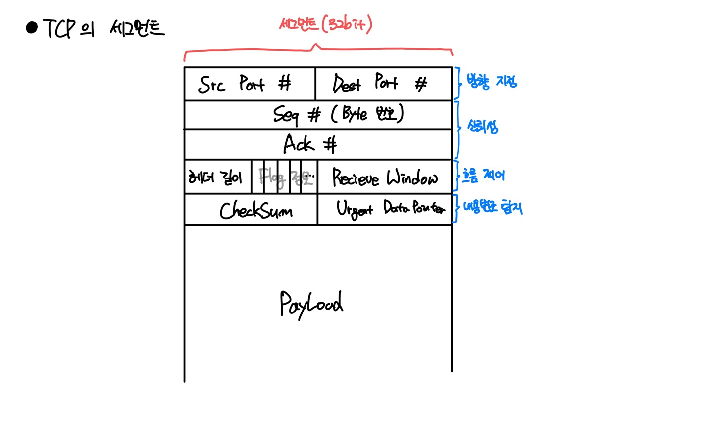

# Chapter3 전송계층

## TCP
연결지향형 트랜스포트이다. 신뢰적인 데이터 전송을 제공하기 위해 TCP에서 오류검출, 재전송 등의 정보를 가지고 있는 TCP헤더필드를 가지고 있다.

### TCP이 보장하는 신뢰
- Reliable Network 보장
- 내용변조 탐지
- 혼잡 제어
- 흐름 제어 (Buffer가 가득 찼을 경우)
- Port의 개념 지원

### TCP 헤더

