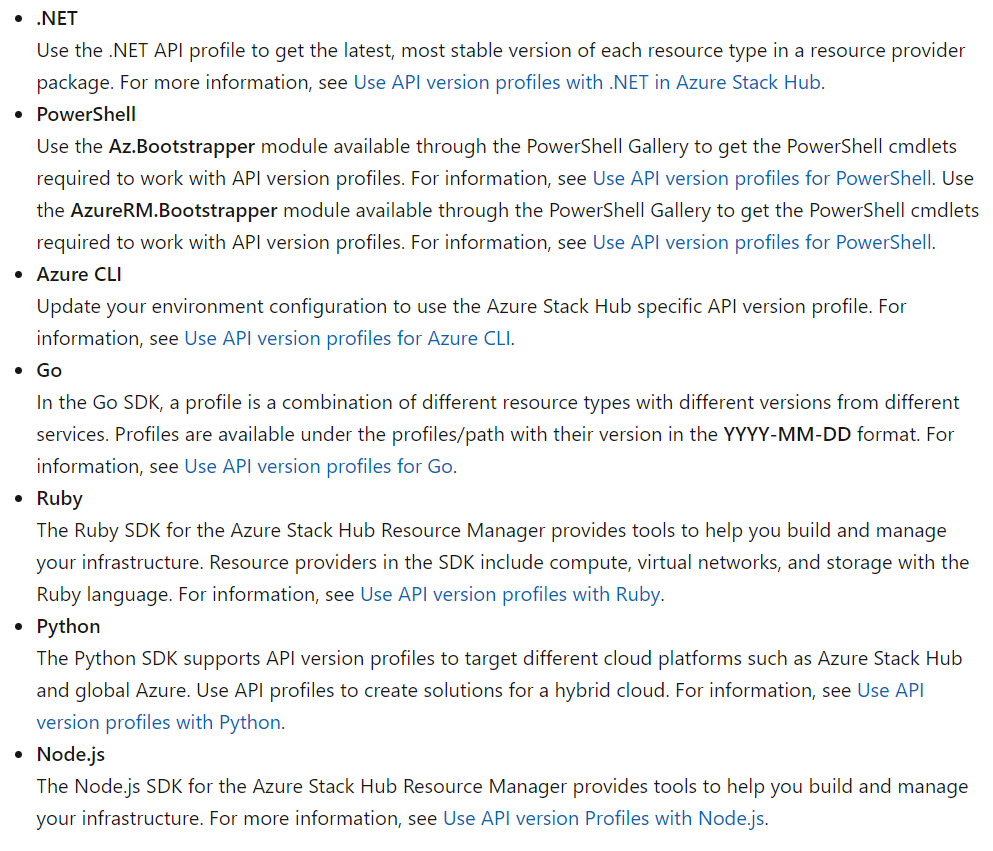

# 두 번째 Issue Shadowing - Azure SDK for java
# Issue #22696

API profile code 샘플페이지 Java section이 빠져있다.

[Manage API version profiles in Azure Stack Hub - Azure Stack Hub](https://docs.microsoft.com/en-us/azure-stack/user/azure-stack-version-profiles?view=azs-2102#api-profile-code-samples)



해당 페이지에 접속해보면 위 문서와 같이 Java가 빠져있다.

## 해결책

- The JAVA SDK for the azure ....
- Use API version Profiles with Java url : [https://docs.microsoft.com/en-us/azure-stack/user/azure-stack-version-profiles-java](https://docs.microsoft.com/en-us/azure-stack/user/azure-stack-version-profiles-java)

을 추가해줘야 한다.

다른 언어들이 설명하고 있는 것들을 참고해서 어떤식으로 설명하면 좋을지 comment를 달아서 시작해도 좋을 것 같다.

## 예상 난이도

**하**

# Issue #24287

## Cosmos DB StoreClient updateResponseHeader 버그

[[BUG] Cosmos DB StoreClient updateResponseHeader · Issue #24287 · Azure/azure-sdk-for-java](https://github.com/Azure/azure-sdk-for-java/issues/24287)

### Describe the bug

Store Client에서 partition key range id를 지우고 있다. (.Net SDK에서는 볼 수 없다.)

session token을 아무 이유없이 재생성하고 있다. session token은 parsing/writing 전 후과 동일한 것 같다. 이는 불필요한 overhead를 추가하고 예외를 유발할 수 있다.

.Net Cosmos DB SDK에서는 동일한 값으로 session token 문자열 parsing/updating을 skip하도록 업데이트 됐다.

### Exception or Stack Trace

.Net에서 헤더를 수정하는것은 `InvalidOperationException`이 발생했다. 왜냐, 만약 캐시가 exception에 hit하면 다수의 document operation이 모두 동일한 캐시 새로고침을 기다리고 있기 때문이다.

캐시 새로고침이 실패했을 때 모든 각각의 스레드에서 같은 예외가 발생한다. 다른 모든 스레드들이 concurrently하게 헤더를 업데이트 하기 때문이다. 헤더는 thread safe가 아니라 예상치 못한 작업과 유효하지 않은 동작에 대해 예외가 발생한다.

### To Reproduce

여러 스레드가 document operation을 수행하도록 한다. 그리고 partition key 또는 address cache가 예외를 발생시키도록 한다.

### Code Snippet

[azure-sdk-for-java/StoreClient.java at 3f31d68eed6fbe11516ca3afe3955c8840a6e974 · Azure/azure-sdk-for-java](https://github.com/Azure/azure-sdk-for-java/blob/3f31d68eed6fbe11516ca3afe3955c8840a6e974/sdk/cosmos/azure-cosmos/src/main/java/com/azure/cosmos/implementation/directconnectivity/StoreClient.java#L172)

### Expected behavior

서비스가 반환한 session token 반환하기 

### Code

```java
private void updateResponseHeader(RxDocumentServiceRequest request, Map<String, String> headers) {
        String requestConsistencyLevel = request.getHeaders().get(HttpConstants.HttpHeaders.CONSISTENCY_LEVEL);

        boolean sessionConsistency =
                this.serviceConfigurationReader.getDefaultConsistencyLevel() == ConsistencyLevel.SESSION ||
                        (!Strings.isNullOrEmpty(requestConsistencyLevel)
                                && Strings.areEqualIgnoreCase(requestConsistencyLevel, ConsistencyLevel.SESSION.toString()));

        long storeLSN = this.getLSN(headers);
        if (storeLSN == -1) {
            return;
        }

        String partitionKeyRangeId = headers.get(WFConstants.BackendHeaders.PARTITION_KEY_RANGE_ID);

        if (Strings.isNullOrEmpty(partitionKeyRangeId)) {
            String inputSession = request.getHeaders().get(HttpConstants.HttpHeaders.SESSION_TOKEN);
            if (!Strings.isNullOrEmpty(inputSession)
                    && inputSession.indexOf(ISessionToken.PARTITION_KEY_RANGE_SESSION_SEPARATOR) >= 1) {
                partitionKeyRangeId = inputSession.substring(0,
                        inputSession.indexOf(ISessionToken.PARTITION_KEY_RANGE_SESSION_SEPARATOR));
            } else {
                partitionKeyRangeId = ZERO_PARTITION_KEY_RANGE;
            }
        }

        ISessionToken sessionToken = null;
        String sessionTokenResponseHeader = headers.get(HttpConstants.HttpHeaders.SESSION_TOKEN);
        if (!Strings.isNullOrEmpty(sessionTokenResponseHeader)) {
            sessionToken = SessionTokenHelper.parse(sessionTokenResponseHeader);
        }

        if (sessionToken != null) {
            headers.put(HttpConstants.HttpHeaders.SESSION_TOKEN,
                        SessionTokenHelper.concatPartitionKeyRangeIdWithSessionToken(partitionKeyRangeId, sessionToken.convertToString()));
        }
				
	    // Partition Key Range ID를 지우고 있음
        headers.remove(WFConstants.BackendHeaders.PARTITION_KEY_RANGE_ID);
    }
```

### 해결책

## 예상 난이도

**상**

# Issue #23844

## Event Hubs Sample에서 issues

[Event Hubs Sample issue · Issue #23844 · Azure/azure-sdk-for-java](https://github.com/Azure/azure-sdk-for-java/issues/23844)

### 1번 이슈 발생 위치

[Link1](https://github.com/Azure/azure-sdk-for-java/blob/main/sdk/eventhubs/azure-messaging-eventhubs/src/samples/java/com/azure/messaging/eventhubs/ConsumeEvents.java#L98), [Link2](https://github.com/Azure/azure-sdk-for-java/blob/main/sdk/eventhubs/azure-messaging-eventhubs/src/samples/java/com/azure/messaging/eventhubs/ConsumeEventsFromKnownSequenceNumberPosition.java#L82), [Link3](https://github.com/Azure/azure-sdk-for-java/blob/main/sdk/eventhubs/azure-messaging-eventhubs/src/samples/java/com/azure/messaging/eventhubs/PublishEventsCustomEndpoint.java#L53)

```java
// Link1 코드
// We create 10 events to send to the service and block until the send has completed.
Flux.range(0, NUMBER_OF_EVENTS).flatMap(number -> {
    String body = String.format("Hello world! Number: %s", number);
		**// 이슈 발생 위치-->**
    **return producer.send(new EventData(body.getBytes(UTF_8)), sendOptions);**
}).blockLast(OPERATION_TIMEOUT);
```

### 원인

`Iterable<com.azure.messaging.eventhubs.EventData>`타입을 요구되지만 `EventData`타입이 반환되고 있음

### 해결책

`Collections.singletonList(new EventData(body.getBytes(UTF_8))`로 변경할 것을 제안

### 2번 이슈 발생 위치

[Link](https://github.com/Azure/azure-sdk-for-java/blob/main/sdk/eventhubs/azure-messaging-eventhubs/src/samples/java/com/azure/messaging/eventhubs/EventHubsJavaDocCodeSamples.java#L634)

```java
// Link 코드
EventProcessorClient eventProcessorClient = new EventProcessorClientBuilder()
            .connectionString(connectionString)
            .processEvent(eventContext -> {
                System.out.printf("Partition id = %s and sequence number of event = %s%n",
                    eventContext.getPartitionContext().getPartitionId(),
                    eventContext.getEventData().getSequenceNumber());
            })
            .processError(errorContext -> {
                System.out.printf("Error occurred in partition processor for partition %s, %s%n",
                    errorContext.getPartitionContext().getPartitionId(),
                    errorContext.getThrowable());
            })
            .consumerGroup("consumer-group")
            .buildEventProcessorClient();
```

### 원인

java.lang.NullPointerException: 'checkpointStore'은 null이 될 수 없음

### 해결책

`.checkpointStore(new SampleCheckpointStore())`처럼 `파라미터 추가`

```java
// 변경된 코드
EventProcessorClient eventProcessorClient = new EventProcessorClientBuilder()
    .connectionString(connectionString)
    .processEvent(eventContext -> {
        System.out.printf("Partition id = %s and sequence number of event = %s%n",
            eventContext.getPartitionContext().getPartitionId(),
            eventContext.getEventData().getSequenceNumber());
	})
        .processError(errorContext -> {
            System.out.printf("Error occurred in partition processor for partition %s, %s%n",
                errorContext.getPartitionContext().getPartitionId(),
                errorContext.getThrowable());
        })
        .consumerGroup("consumer-group")
        **.checkpointStore(new SampleCheckpointStore())**
        .buildEventProcessorClient();
```

## 예상 난이도

**중하**