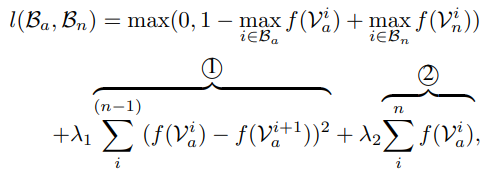

# Real-world Anomaly Detection in Surveillance Videos(작성중)

https://arxiv.org/abs/1801.04264

## 0. Abstract

CCTV 영상은 실세계의 다양한 anomalous(이상) 상황을 포착한다. 이 논문에서는 normal(정상), anomalous(이상) 비디오를 둘 다 학습시키는 방법을 제안한다.

이상 데이터를 weakly labeled training 비디오들을 활용해 deep multiple instance ranking framework를 통해 학습하도록 한다.

해당 모델은 anomalous 비디오가 있는 anomalous bag, normal 비디오가 있는 normal bag 두 부분으로 나누어 multiple instance learning을 하고 자동적으로 deep anomaly ranking model을 학습시키고 anomalyh score를 예측한다. 추가적으로 loss function에서 사용하는 sparsity 와 temporal smoothness constraints을 소개한다.

## 1. Introduction
- Motivation and contributions
  
  실생활에서는 normal과 anomalous 행동은 종종 모호하다. 따라서 이런 이벤트들을 더 잘 탐지할 수 있는 시스템이 필요하다.

- Anomaly detection을 위해 weakly-labeled training 비디오를 활용함으로서 MIL을 제안한다.
  
- Anomaly score를 학습하기 위해 sparsity,smoothness constraints 와 함께 MIL ranking loss를 사용하는 것을 제안한다.

- large-scale video 1900 real-world 데이터셋이 있다.

- 현재 state-of-the-art의 anomaly detection 접근법에 상응하는 superior performance를 보여준다.

## 2. Related Work

### Anomaly Detection

지금까지는 sparse representaion과 dictionary learning 방법으로 몇 년간 사용되어왔다. 하지만 large reconstruction error를 가진 패턴을 anomalous 상황으로 판단하는 오류가 있었다. 이미지 분류를 위한 deep learning 방법을 사용하는 것이 좋다는 입증 때문에, 다양한 방법들이 등장했다.

하지만, 비디오같은 경우 학습을 위한 annotation들을 구하기도 어렵고 만들기도 매우 힘든 작업이다.

최근에는 labeling이 필요없는 Autoencoder를 사용한 anomaly detection이 나왔지만 여기서는 weakly labeled training data를 사용한 접근 방법을 사용한다.

### Ranking

Learning to rank는 머신러닝 분야에서 활발하게 연구가 이루어지고 있다. 이 접근 방법은 아이템의 개별 score 보다는 연관 score를 더 발전시키는데 집중하는 방법이다.

최근에는 deep ranking networks가 비전 분야에서도 state-of-the-art 성능으로 사용되고 있다.
모든 deep ranking 방법은 상당한 양의 positive, negative 데이터 샘플이 필요하다.

반면, 우리는 normal, anomalous 데이터르르 활용한 ranking framework로 regression 문제로 anomaly detection을 구현했다.

정확한 segment-level의 라벨링을 하는데 어려움을 완화하기 위해 우리는 weakly labeled 데이터를 사용한 Multiple Instance Learning을 활용했다.

## 3. Proposed Anomaly Detection Method

positive, negative bags을 가지고, deep MIL ranknig  anomaly detection 모델을 학습시켰다.

### 3.1 Multiple Instance Learning

일반적인 supervised learning에서 optimization function과 loss function은 다음과 같다.

- Optimization function

  

- Loss function(hinge loss)

  

  -  **0** or **1 - (normal 중에 가장 anomal 점수가 큰 instance - anomal 중에 가장 anomal 점수가 큰 instance)** => loss가 작아진다 = anomal instance의 점수를 높히고, nomal 중에 점수가 큰 instance의 점수를 낮춘다.

- 기존 loss function의 한계점
  1. real-world에서는 anomaly가 발생하는 moment가 매우 드물기 때문에 적은 segment 안에 sparse하게 anomaly가 있다.

  2. video는 sequence이기 때문에, 인접한 video segment간에 점수 차이를 smooth 하게 변화하도록 해야한다.

### 3.2 Deep MIL Ranking Model
기존 loss function에 다음과 같은 제약조건을 포함했다.

 1. temporal smoothness : 인접한 segment간의 차이의 제곱을 제약조건으로 두어 인접한 segment간의 점수차이를 좁힌다.

 2. sparsity : anomaly 점수의 합을 제약조건으로 두어 anomaly의 희소성을 완화시킨다.

## 4. Dataset

### Previous datasets

### Our dataset

## Experiments